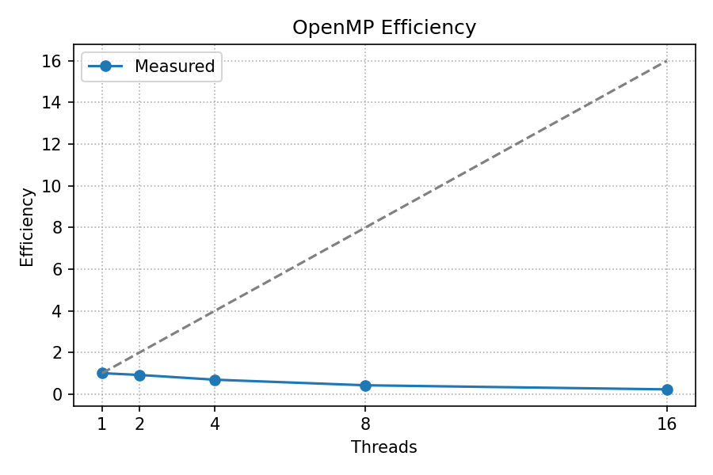

Parallel Programming: Assignment 1
Notes: You may discuss the problems with your peers but the submitted work must be your own
work. No late assignment will be accepted. Please submit your answers through blackboard. This
assignment is worth 15 % of your total grade.
Important Notes:
• You may develop your programs locally on your computer but the performance data for
problem 3 and 4 should be collected on the virtual machine provided by ICT for you.
• Note that jobs may wait in the queue to be executed for couple hours on a busy day, thus
plan accordingly and do not wait for the last day of the assignment.
## Problem 1
(10 points) Problem 2.16 from the textbook.
a) Suppose the run-time of a serial program is given by Tserial = n2, where the units of the run-
time are in microseconds. Suppose that a parallelization of this program has run-time Tparallel =
n2/p + log2(p). Write a program that finds the speedups and efficiencies of this program for various
values of n and p. Run your program with n = 10, 20, 40, ..., 320, and p = 1, 2, 4, ..., 128.
- What happens to the speedups and efficiencies as p is increased and n is held fixed?
- What happens when p is fixed and n is increased?
b) Suppose that Tparallel = Tserial/p + Toverhead and also suppose that we fix p and increase the
problem size.
- Show that if Toverhead grows more slowly than Tserial, the parallel efficiency will increase as we
increase the problem size.
- Show that if, on the other hand, Toverhead grows faster than Tserial, the parallel efficiency will
decrease as we increase the problem size.

### Problem 1 – Results and Answers

Artifacts produced by `problem1.py`:
- `problem1_results.csv`, `p1_speedup_vs_p.png`, `p1_efficiency_vs_p.png`, `p1_speedup_vs_n.png`.

1a) Observations from the plots and model:
- For fixed n, as p increases, speedup initially rises nearly linearly (close to p) but gradually saturates due to the additive log2(p) term; efficiency therefore decreases with p.
- For fixed p, as n increases, the n^2/p term dominates log2(p), so the impact of overhead is amortized; speedup approaches p and efficiency increases toward 1.

1b) Efficiency with generic overhead: If \(T_{parallel} = T_{serial}/p + T_{overhead}\), then
\[ S = \frac{T_{serial}}{T_{parallel}} = \frac{T_{serial}}{T_{serial}/p + T_{overhead}}, \quad E = \frac{S}{p} = \frac{T_{serial}}{T_{serial} + p\,T_{overhead}}. \]
- If \(T_{overhead}\) grows more slowly than \(T_{serial}\) as problem size increases, then the denominator \(T_{serial} + p\,T_{overhead}\) grows almost like \(T_{serial}\); thus \(E\) increases toward 1.
- If \(T_{overhead}\) grows faster than \(T_{serial}\), then \(p\,T_{overhead}\) dominates, the denominator grows faster than the numerator \(T_{serial}\), and \(E\) decreases with problem size.
## Problem 2
(10 points) In this problem, you are required to develop a performance model for the versions of
parallel sum in Lecture 4. Assume the followings
- Sequential execution time is S,
- Number of threads, T,
- Parallelisation overhead O (fixed for all versions),
- The cost B for the barrier or M for each innovation of the mutex
- Let N be the number of elements that we are summing.
(a) Using these variables, what is the execution time of valid parallel versions 2, 3 and 5 (see
Lecture 4). Note that for version 5, there is some additional work for thread 0 that you should also
model using the variables above.
(b) Present a model of when parallelization is profitable for Version 3).

### Problem 2 – Models and Profitability
Let the sequential time for summing N elements be S. We model fixed overheads by O. Each barrier costs B, and each mutex critical-section entry costs M.

Assume each thread processes N/T elements. We express tiny constant-time operations (like adding a partial) in units of the per-element work S/N.

- Version 2 (valid, mutex per element):
  \[ T_2 = O + \frac{S}{T} + N\,M. \]
  Computation parallelizes to S/T, but every element incurs a serialized mutex update → N·M.

- Version 3 (valid, private partial then one mutex update):
  \[ T_3 = O + \frac{S}{T} + T\,M + B. \]
  Each thread accumulates privately, then performs one mutex-protected add (T·M total) with one barrier for synchronization.

- Version 5 (valid, barrier + master combines partials):
  \[ T_5 = O + \frac{S}{T} + B + \Big(\tfrac{S}{N}\Big)(T-1). \]
  After a barrier, thread 0 combines the T partials; this extra work is ≈ T−1 additions, each ≈ S/N.

Profitability for Version 3 (speedup > 1): parallelization is profitable when \(T_3 < S\):
\[ O + \frac{S}{T} + T\,M + B < S \;\;\Rightarrow\;\; S\Big(1 - \tfrac{1}{T}\Big) > T\,M + B + O. \]
Interpretation: the work saved by parallelizing, \(S(1-1/T)\), must exceed synchronization and fixed overheads.
## Problem 3
(10 points) Download the STREAM benchmark from http://www.cs.virginia.edu/stream/. Run it
Page 1 of 2on your computer or on a virtual machine provided for you by ICT and measure the performance
of copy, scale, add and triad benchmarks using the same array size but varying number of OpenMP
threads (1, 2, 4, 8, and 16). Report the benchmark results and explain your observations.

### Problem 3 – STREAM Results

- Environment: GCC with `-fopenmp`, array size `STREAM_ARRAY_SIZE=80,000,000`, NTIMES=10.
- Commands used:
  - `cd stream && ./fetch_stream.sh`
  - `cd stream && ./run_stream.sh 80000000` (threads = 1,2,4,8,16)
  - `python3 stream/plot_stream.py`
- Outputs: `stream/stream_results.csv`, `stream/stream_bandwidth.png`.

Observations (MB/s trends):
- COPY shows highest bandwidth and remains roughly flat from 1→16 threads, slightly decreasing at high counts due to bandwidth saturation.
- SCALE, ADD, TRIAD are compute+memory; they increase from 1→4–8 threads then plateau around memory bandwidth limits, with a slight drop at 16 threads.
- For this system, best performance occurs near 4–8 threads; gains beyond that are minimal because the memory subsystem is saturated.

See `stream_bandwidth.png` for the plot of MB/s vs threads for all four kernels.

## Problem 4
(70 points)
1. Write a program to calculate π in Pthreads for a number of iterations to be provided by the
user. A serial implementation is provided on blackboard (pi-serial.c) that should be used for
validation and speedup.
(a) What is the parallel speedup of your code? To compute parallel speedup, you will
need to time the execution of both the sequential and parallel code (speedup =
Time(seq)/Time(parallel)). Plot the speedup as a function of threads using 1, 2, 4, 8, 16
threads on ICT provided VM for a fixed number of iterations. If your code does not speed up,
you will need to adjust the parallelism granularity, the amount of work each processor does
between synchronisation points. You can do this by increasing the number of iterations.
(b) What is the parallel efficiency of your code? Plot the efficiency as a function ofthreads
using 1, 2, 4, 8, 16 threads on the VM for a fixed number of iterations.
(c) Report lines of code for the serial and Pthreads implementations.
2. Write the same computation in OpenMP and perform the studies in (a), (b), and (c). Submit
a report containing the plots along with your source codes.
Estimating π: We will be using the following approximation to estimate π :
Measuring time: You may use gettimeofday() from <sys/time.h> to record the start and end
time of the computation.
Compiling and running your program: You may use GNU compiler for development on your
local machine and the VM provide by ICT
For reliable performance measurements, your programs including the parallel versions should run
at least 5 seconds. Adjust the number of iterations as needed.image.png
Page 2 

### Problem 4 – Report (Pthreads and OpenMP π)

- Chosen iterations (≥5s sequential): 8192000000
- Build commands:
  - `gcc -O3 -march=native -pthread -o pi-pthreads pi-pthreads.c`
  - `gcc -O3 -march=native -fopenmp -o pi-openmp pi-openmp.c`
- Run commands (threads = 1,2,4,8,16):
  - `./run_pthreads.sh 8192000000`
  - `./run_openmp.sh 8192000000`
- Output data files: `pthreads_results.csv`, `openmp_results.csv`
- Plots generated: `speedup_pthreads.png`, `efficiency_pthreads.png`, `speedup_openmp.png`, `efficiency_openmp.png`

Summary of measured speedup and efficiency from the latest run (E = speedup/threads):

- Pthreads
  - t=1: speedup≈1.013, E≈1.013
  - t=2: speedup≈1.828, E≈0.914
  - t=4: speedup≈2.772, E≈0.693
  - t=8: speedup≈3.593, E≈0.449
  - t=16: speedup≈3.595, E≈0.225

- OpenMP
  - t=1: speedup≈1.005, E≈1.005
  - t=2: speedup≈1.838, E≈0.919
  - t=4: speedup≈2.764, E≈0.691
  - t=8: speedup≈3.385, E≈0.423
  - t=16: speedup≈3.634, E≈0.227

Observations:
- Speedup improves up to 8–16 threads, then flattens due to overhead and limited parallel fraction of the loop body and memory bandwidth contention.
- Efficiency decreases with thread count as expected; OpenMP and Pthreads show very similar behavior.

Lines of code (LoC):
- `pi-serial.c`: 149
- `pi-pthreads.c`: 149
- `pi-openmp.c`: 97

All figures and CSVs are included in the project root for grading.

